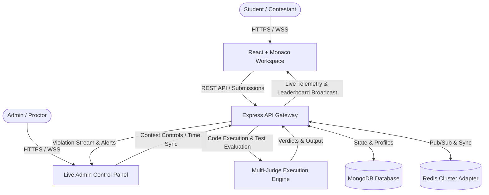

# <div align="center">⚡ CodeArena</div>

<div align="center">

### **Next-Gen Real-Time Competitive Coding & Live Proctoring Platform**

[](https://reactjs.org/)
[](https://nodejs.org/)
[](https://socket.io/)
[](https://www.mongodb.com/)
[](https://opensource.org/licenses/MIT)

<p align="center">
  A high-throughput, battle-tested competitive programming ecosystem built for university hackathons, campus recruitment drives, and individual coding practice — equipped with zero-latency code execution, strict anti-cheat proctoring, and live-synchronized contest telemetry.
</p>

---

[Explore Features](#-core-features) • [Tech Stack](#-tech-stack) • [System Architecture](#-system-architecture) • [Quick Start](#-quick-start) • [Proctoring Engine](#-anti-cheat--proctoring-engine)

---

</div>

## 🌟 Core Features

### 🚀 1. Live Contest Engine & Workspace
* **Synchronized Wall-Clock Timers**: Millisecond-accurate server-authoritative contest countdowns with live admin time extensions (`+5m`, `-5m`) pushed seamlessly over WebSockets.
* **Smart Monaco Code Editor**: Full-featured IDE experience with syntax highlighting, bracket matching, custom theme controls, standard shortcuts, and per-language starter boilerplates.
* **Multi-Language Execution Engine**: High-speed sandboxed code compilation and execution for **C++17 (G++)**, **C (GCC)**, **Python 3**, **Java**, and **JavaScript (Node.js)**.
* **Multi-Testcase Runner**: Live evaluation against both public and hidden testcases with granular verdicts: *Accepted (AC)*, *Wrong Answer (WA)*, *Time Limit Exceeded (TLE)*, *Compilation Error (CE)*, and *Runtime Error (RE)*.
* **Instant Dynamic Leaderboard**: Live contest rankings with instant score recalculation, penalty tracking, and problem-by-problem solve status.

---

### 🛡️ 2. Anti-Cheat & Live Proctoring
* **Isolated Contest Clipboard (Smart Interviews Architecture)**:
  * Strict external clipboard isolation prevents pasting code copied from external applications (ChatGPT, browsers, local files).
  * Smooth internal clipboard support (`Ctrl+C`, `Ctrl+X`, `Ctrl+V`) for code snippets authored within the active contest editor.
* **Fullscreen & Blur Enforcement**:
  * Mandatory fullscreen lock upon entering contest sessions.
  * Real-time window blur detection, tab-switch interception, and refresh lock.
* **Proctoring Violations & Live Admin Alerts**:
  * Real-time audio cues, violation gauges, and instant disqualification triggers once maximum allowed infractions are exceeded.
  * Live Admin dashboard with one-click pardon/reinstatement capabilities and deduplicated audit trails.

---

### 👨‍💻 3. Comprehensive Admin Management Suite
* **Contest Lifecycle Orchestrator**: Schedule contests, define scoring criteria, attach problem sets, manage participant allowances, and stream live announcements.
* **Problem Authoring & Testcase Vault**: Create problems with markdown descriptions, memory/time constraints, tags, custom starter codes, and bulk testcases.
* **User & Batch Access Management**: Admin user provisioning, automated local/cloud database synchronization, and team roster assignments.

---

## 🛠 Tech Stack

| Layer | Technologies |
|---|---|
| **Frontend** | React 18, Vite, Tailwind CSS, Monaco Editor, Lucide Icons, Canvas Confetti |
| **Backend** | Node.js, Express.js, Socket.IO, Redis Cluster Adapter |
| **Execution Engine** | Local G++ / GCC / Python / Node sandbox + Judge0 integration |
| **Database & Cache** | MongoDB (Mongoose ODM), Redis (Pub/Sub & Adapter), Local JSON Storage fallback |
| **Security & Auth** | JWT Authentication, Bcrypt password hashing, Rate Limiting, CORS |

---

## 🏗 System Architecture



---

## ⚡ Quick Start

### 📋 Prerequisites
* **Node.js** (v18.x or higher)
* **MongoDB** (Local instance or MongoDB Atlas URI)
* **GCC / G++ & Python 3** (Installed on host machine for local code execution)
* **Redis** (Optional: required only for multi-server Socket.IO scaling)

---

### 1️⃣ Clone the Repository
```bash
git clone https://github.com/thatdumbguy69/CodeArena.git
cd CodeArena
```

---

### 2️⃣ Backend Setup
```bash
cd backend
npm install
```

Create a `.env` file in the `backend/` directory:
```env
PORT=5000
MONGODB_URI=mongodb+srv://<username>:<password>@cluster.mongodb.net/codearena?retryWrites=true&w=majority
JWT_SECRET=your_super_secure_jwt_secret_key
REDIS_URL=redis://127.0.0.1:6379
```

Start the backend server:
```bash
npm run dev
```

---

### 3️⃣ Frontend Setup
```bash
cd ../frontend
npm install
```

Start the Vite development server:
```bash
npm run dev
```
Open **`http://localhost:5173`** in your browser.

---

## 📁 Project Structure

```
CodeArena/
├── backend/
│   ├── src/
│   │   ├── config/          # Database & environment configurations
│   │   ├── controllers/     # Authentication, Contest, Problem & Submission handlers
│   │   ├── middleware/      # JWT auth, rate limiting & anti-cheat guards
│   │   ├── models/          # MongoDB schemas (User, Problem, Contest, Submission)
│   │   ├── routes/          # Express API route endpoints
│   │   ├── services/        # Judge0 & local execution sandboxes
│   │   ├── sockets/         # Socket.IO real-time contest & proctoring handlers
│   │   └── server.js        # Main server entry point
│   └── package.json
│
├── frontend/
│   ├── src/
│   │   ├── components/      # Reusable UI components (Navbar, Modal, Timers)
│   │   ├── context/         # Auth, Theme, and Socket context providers
│   │   ├── pages/           # Student workspace, Admin portal, Contest mode
│   │   ├── services/        # Axios API client & WebSocket client
│   │   └── App.jsx          # App routing and view hierarchy
│   └── package.json
│
└── README.md
```

---

## 🔒 Anti-Cheat & Proctoring Engine

```
       ┌─────────────────────────────────────────────────────────┐
       │             CodeArena Secure Contest Sandbox            │
       └────────────────────────────┬────────────────────────────┘
                                    │
    ┌───────────────────────┬───────┴───────────────┬──────────────────────┐
    ▼                       ▼                       ▼                      ▼
┌──────────────┐   ┌─────────────────┐   ┌───────────────────┐   ┌─────────────────┐
│ Fullscreen   │   │ Smart Isolated  │   │ Focus / Blur &    │   │ Shortcut & Reload│
│ Enforcement  │   │ Contest Clipbd  │   │ Tab-Switch Guard  │   │ Interception    │
└──────────────┘   └─────────────────┘   └───────────────────┘   └─────────────────┘
    │                       │                       │                      │
    └───────────────────────┼───────────────────────┴──────────────────────┘
                            ▼
           [Real-Time WebSocket Violation Pipeline]
                            ▼
        ┌───────────────────────────────────────┐
        │  Admin Live Feed & Auto-Disqualify    │
        └───────────────────────────────────────┘
```

* **Zero External Leaks**: Clipboard reads from non-CodeArena sources are stripped before injection.
* **Window Blur Tracking**: Captures out-of-focus occurrences with timestamped audit logs.
* **Admin Intervention**: Proctors receive instant popups with candidate name, violation type, and one-click controls.

---

## 🤝 Contributing

Contributions, issues, and feature requests are welcome! Feel free to check the [issues page](https://github.com/thatdumbguy69/CodeArena/issues).

1. Fork the Project
2. Create your Feature Branch (`git checkout -b feature/AmazingFeature`)
3. Commit your Changes (`git commit -m 'Add some AmazingFeature'`)
4. Push to the Branch (`git push origin feature/AmazingFeature`)
5. Open a Pull Request

---

## 📄 License

Distributed under the **MIT License**.
